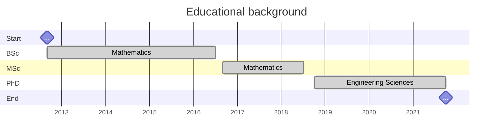

> **Awards**\\
> Aix-Marseille University Thesis Award 2022. \\
> Issued by Aix-Marseille University on April 11th, 2023 in Marseille, France.\\
> [Click here for more details !](https://www.univ-amu.fr/fr/public/actualites/soiree-scientifique-2022-remise-des-doctorats-honoris-causa-des-prix-de-these)
{: .prompt-info }

- **2018-2021** {: width="160" height="100" .w-25 .right}
  > **Doctor of Philosophy (PhD)**, Engineering Sciences in Solid Mechanics.\
  > ED 353, Aix-Marseille University. Marseille, France.\
  > Research unit of CNRS: [LMA](https://laboratoire-mecanique-acoustique.fr/) (UMR 7031).\
  > [Thesis:](https://theses.fr/2021AIXM0552) "Modeling of linear viscoelastic composite materials with hierarchical structure and imperfect interfaces via a three-scale asymptotic homogenization approach". \
  > Supervisor: [Frederic Lebon](mailto:lebon@lma.cnrs-mrs.fr)\
  > Co-supervisor: [Reinaldo Rodríguez Ramos](mailto:rerora2006@gmail.com)

- **2016-2018** {: width="100" height="60" .w-25 .right}
  > **Master of Science (MSc)**, Mathematics.\
  > University of Havana. [MATCOM](https://matcom.uh.cu/). Havana, Cuba.\
  > Research: "Homogenization of linear, non-ageing, viscoelastic composites with generalized periodicity".

- **2012 - 2016** {: width="100" height="60" .w-25 .right}
  > **Bachelor of Science (BSc)**, Mathematics.\
  > University of Havana. [MATCOM](https://matcom.uh.cu/). Havana, Cuba.

  

