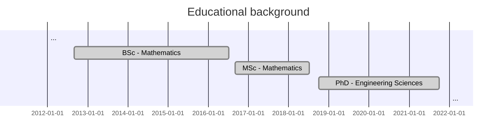

<!-- Style -->

<!-- Content -->

> **Awards**\\
> Aix-Marseille University Thesis Award 2022. \\
> Issued by Aix-Marseille University on April 11th, 2023 in Marseille, France.\\
> [Click here for more details !](https://www.univ-amu.fr/fr/public/actualites/soiree-scientifique-2022-remise-des-doctorats-honoris-causa-des-prix-de-these)
{: .prompt-info }

<!-- PhD - Marseille, France -->

  

  

    

    2018-2021
     Marseille, France
    

  

  

    <ul>
      <li> 
        <b> Doctor of Philosophy (PhD), Engineering Sciences in Solid Mechanics</b>. 
          Aix-Marseille University. L’Ecole Doctorale Sciences pour l’Ingénieur :   Mécanique, Physique, Micro et Nanoélectronique / ED 353. 
          Research unit of CNRS: Laboratoire de Mécanique et d’Acoustique (UMR 7031)
          <a href="https://theses.fr/2021AIXM0552"> 
          Thesis: 
        </a> "Modeling of linear viscoelastic composite materials
          with hierarchical structure and imperfect interfaces
          via a three-scale asymptotic homogenization approach." 
          Supervisor: <a href="mailto:lebon@lma.cnrs-mrs.fr"> Frederic Lebon</a>
	        Co-supervisor: <a href="mailto:reinaldo@matcom.uh.cu"> Reinaldo Rodríguez Ramos</a>
      </li>
    </ul>
  

  

    
  

  

<!-- MSc - Havana, Cuba -->

  

 <!-- Minimal width column for spacing -->
  

    

    2016 - 2018
     Havana, Cuba
    

  

  

    <ul>
      <li> 
        <b> Master of Science (MSc), Mathematics</b>. 
          University of Havana. Faculty of Mathematics and Computer Sciences. 
          Research: "Homogenization of linear, non-ageing,  viscoelastic composites with generalized periodicity"
      </li>
    </ul>
  

  

    
  

  

 <!-- Minimal width column for spacing -->

<!-- BSc - Havana, Cuba -->

  

 <!-- Minimal width column for spacing -->
  

    

      2012 - 2016
       Havana, Cuba 
    

  

  

    <ul>
      <li> 
        <b> Bachelor of Science (BSc), Mathematics</b>
          University of Havana. Faculty of Mathematics and Computer Sciences. 
      </li>
    </ul>
  

  

    
  

  

 <!-- Minimal width column for spacing -->

