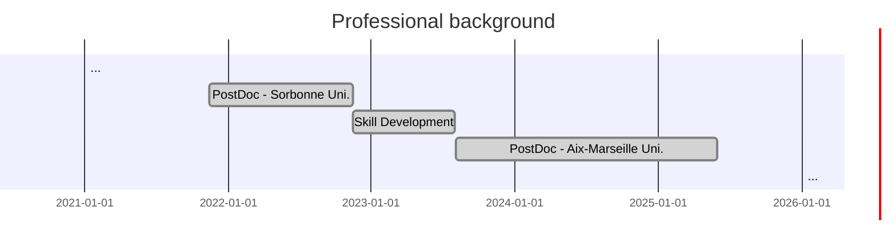

- **2023-2025**
  > Postdoctoral Research Associate: **AI for Engineering**. \
  > Aix-Marseille University. Marseille, France. \
  > [IRPHE](https://irphe.univ-amu.fr/) (UMR7342, Bio-mechanics team). \
  > [AMSE](https://www.amse-aixmarseille.fr/fr) (UMR7316, Econometrics and Statistics team).\
  > [Full description ...](/experience-full-description/postdoc-marseille-2023-2025)

{: width="972" height="589" .w-50}

- **2021-2022**
  > Postdoctoral Research Associate: **Advanced Micromechanical Models**. \
  > Sorbonne University, UFR d'ingénierie. Paris, France.\
  > [Institute Jean le Rond d'Alembert](https://www.dalembert.upmc.fr/ijlrda/) (UMR7190, MISES team).\
  > [Full description ...](/experience-full-description/postdoc-paris-2021-2022)

{: width="972" height="589" .w-50}

