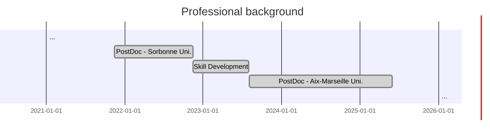

<!-- Style -->

<!-- Content -->

<!-- Postdoc - Marseille, France -->

  

  

    

    2023-2025
      Marseille, France

  

  

    <ul>
      <li> <b>Postdoctoral Research Associate:</b> AI for Engineering.
    Aix-Marseille University.
      <a href="https://irphe.univ-amu.fr/">
          IRPHE
        </a> (UMR7342, Bio-mechanics team).
    <a href="https://www.amse-aixmarseille.fr/fr">
          AMSE
        </a> (UMR7316, Econometrics and Statistics team).
      <a href="/experience-full-description/postdoc-marseille-2023-2025">
      Full description ...
        </a>
        </li>
    </ul>
  

  

    
  

  

<!-- Postdoc - Paris, France -->

  

  

    
2021-2022   Paris, France

  

  

    <ul>
      <li> <b>Postdoctoral Research Associate:</b> Advanced Micromechanical Models.
    Sorbonne University, UFR d'ingénierie.
      <a href="https://www.dalembert.upmc.fr/ijlrda/">
          Institute Jean le Rond d'Alembert  
        </a> (UMR7190, MISES team).
      <a href="/experience-full-description/postdoc-paris-2021-2022">
      Full description ...
        </a>
        </li>
    </ul>
  

  

    
  

  

