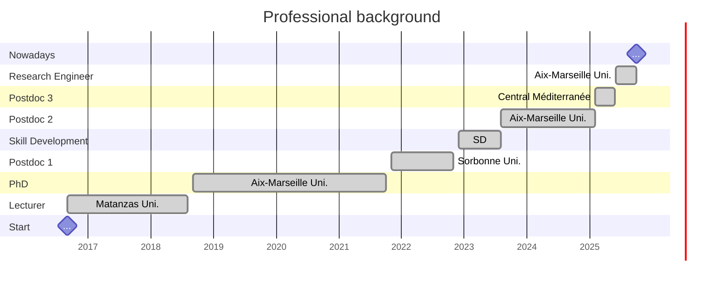

- **Jun 2025 - Present** {:.w-25 .right}
  > Research Engineer: **AI for Science**. \
  > Aix-Marseille University. Marseille, France. \
  > [AMSE](https://www.amse-aixmarseille.fr/fr) (UMR7316, Econometrics and Statistics team).

- **Feb 2025 - May 2025** {:.w-25 .right}
  > Postdoctoral Research Associate: **AI for Science**. \
  > Central Méditerranée. Marseille, France. \
  > [IRPHE](https://irphe.univ-amu.fr/) (UMR7342, Bio-mechanics team). 
 
- **Aug 2023 - Jan 2025** {:.w-25 .right}
  > Postdoctoral Research Associate: **AI for Science**. \
  > Aix-Marseille University. Marseille, France. \
  > [IRPHE](https://irphe.univ-amu.fr/) (UMR7342, Bio-mechanics team). \
  > [AMSE](https://www.amse-aixmarseille.fr/fr) (UMR7316, Econometrics and Statistics team).\
  > [Full description ...](/experience-full-description/postdoc-marseille-2023-2025)

- **Nov 2021 - Nov 2022** {:.w-25 .right}
  > Postdoctoral Research Associate: **Advanced Micromechanical Models**. \
  > Sorbonne University, UFR d'ingénierie. Paris, France.\
  > [Institute Jean le Rond d'Alembert](https://www.dalembert.upmc.fr/ijlrda/) (UMR7190, MISES team).\
  > [Full description ...](/experience-full-description/postdoc-paris-2021-2022)

- **Oct 2018 - Sept 2021** {:.w-25 .right}
  > Research PhD Student: **Micromechanical Models**. \
  > Aix-Marseille University, ED353. Marseille, France.\
  > [LMA](https://laboratoire-mecanique-acoustique.fr/) (UMR7031, Materials and Structures team).\
  <!-- > [Full description ...](/experience-full-description/phd-marseille-2018-2021) -->

- **Sept 2016 - Jul 2018** {:.w-25 .right}
  > Lecturer: **Mathematics**. \
  > Mathematics Department, Faculty of Pedagogical Sciences. University of Matanzas. Matanzas, Cuba.\
  > Description:
  > - Lectures on Probability and Statistics, Calculus I, II and Numeric Methods.
	> - Development of skills in teaching methods and math education.
  <!-- > [Full description ...](/experience-full-description/lecturer-cuba-2016-2018) -->

